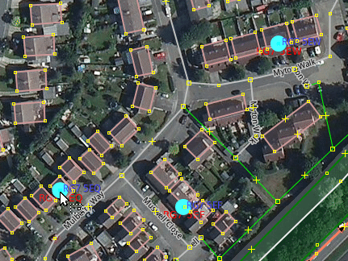

# import_postcodes
Converts postcodes from [Code-Point Open](https://www.ordnancesurvey.co.uk/business-and-government/products/code-point-open.html) format to `.osm` files that can be open in jOSM.

Once open in jOSM, postcode tags can be easily transferred to OSM objects, usually buildings:

This repository contains pre-generated `.osm` files, so running the script is not required. To make adding postcodes easier, three sets of files are provided - original (all) postcodes, postcodes that do not exist in OSM, and missing postcodes with a building nearby.

## Licensing
Code-Point Open is an Ordnance Survey product [covered](https://www.ordnancesurvey.co.uk/business-and-government/products/code-point-open.html) by the Open Government Licence (OGL).

- Contains OS data © Crown copyright and database right 2018
- Where you use Code-Point Open data, you must also use the following attribution statements:
- Contains Royal Mail data © Royal Mail copyright and Database right 2018
- Contains National Statistics data © Crown copyright and database right 2018

## Additional information on UK postcodes and Code-Point Open centroids
- [Wikipedia entry for UK postcodes](https://en.wikipedia.org/wiki/Postcodes_in_the_United_Kingdom)
- [Robert's page on mapping UK addresses and postcodes, including mapping stats](https://osm.mathmos.net/addresses/)
- [Ragged Red Code-Point Open tiles](http://codepoint.raggedred.net/)

## Why

Postcodes in the UK are very commonly used for geocoding. In general, a postcode and a house number are the only two pieces of information needed to find any UK address. Code-Point Open data are less precise, providing only one postcode for each postal sector, but since postal sectors are small the postcodes are still useful for finding approximate locations.

## Usage

### Pre-generated `.osm` files

A `osm_files` directory contains three versions of `.osm` files converted from source `.csv` files provided by Ordnance Survey. The variants are:
1. `osm_files/centroids` - all CodePoint Open centroids. Each object is tagged with an `addr:postcode` tag and a `removemelater=yes` marker assisting in the cleaning process.
2. `osm_files/centroids_not_in_osm` - centroids without a corresponding OSM object (with `addr:postcode` tag) within an approximately 10m radius. Recommended for partially mapped areas without nearby buildings in the OSM database.
3. `osm_files/centroids_near_buildings` - as above, but with OSM buildings nearby. Recommended as a starting point for areas with buildings.

A typical workflow may look as follows (jOSM only):
1. (optional) Set up Ragged Red Code-Point Open tile background layer for previewing surrounding postcodes when no centroid files are loaded
2. (recommended) Add `Postcodes_Map_Paint_Style.mapcss` to _Preferences_/_Map Settings_/_Map Paint Styles_ to provide visual feedback on what OSM objects are tagged with `addr:postcode`.
3. Download map data from the server, set the background imagery etc.
4. Open one of the provided .osm files with Code-Point Open centroids
5. Select all points in the centroids layer and merge them (`Ctrl+Shift+m`) with the data layer. **IMPORTANT! DO NOT UPLOAD DATA TO OSM WITHOUT CLEANING THEM UP AS DESCRIBED BELOW**
6. Manualy Copy->Paste tags from centroids to buildings taking time to think on what centroids are not suitable. Check the Caveats section below for potential problems. Code-Point Open data are purposely made imprecise, so please refrain from automatic editing.
   - (recommended) re-map _Copy Tags_ and _Paste Tags_ to more ergonomic key combinations. These shortcuts are used a lot.
7. **IMPORTANT: Cleaning up:**
   - In the _Selection_ pane search for all objects containing exactly two tags and one of them is named `removemelater`. The exact query is: `removemelater "addr:postcode" tags:2`. This should select all previously merged centroids. Delete all selected objects.
   - In the _Selection_ pane search for all objects containing a `removemelater` tag. The query is: `removemelater`. This should select all object to which we copied `addr:postcode` and `removemelater` tags in step 6. In the _Tags/Memberships_ pane select a `removemelater` tag and delete it from all selected objects.
8. Upload changes to OSM.
  
#### Caveats
- Code-Point Open data only provide one postcode for each postal sector. This postcode is placed near the centroid of the sector and is then snapped to a nearest delivery point, in most cases a building.
- One postcode is used for a single street only, but addresses at a single street may have more postcodes.
- The most common issue is that a single building may have multiple postcodes. This is usually due to:
  - A building having multiple parts with distinct addresses, for example street names.
  - Code-Point Open not differentiating between _residential_ and _large user_ postcodes.
  - PO boxes at Royal Mail distribution centres.
- Note that even when it appears a building has a single postcode, it may not be the case. For example the centroid may be marking a large user postcode but the building may also have a residential postcode.
- In general, be very careful when adding postcodes in dense urban areas, especially with large businesses or organisations. In such cases, it may be better to compare the data against other sources, like FHRS.

### Generate your own `.osm` files
This may be useful when more frequent updates are needed. For example, when adding many postcodes in a single postal area.

Procedure:
1. Request a copy of Code-Point Open data from Ordnance Survey, place it in `codepo_gb` directory and unzip it.
2. Download a current extract of OSM UK data and pre-process it using a `download_map_data.sh` script. Note that this will download about 1GB of data from [GeoFabrik](http://download.geofabrik.de/europe/)
3. Run an `import_postcodes.py` to process the data and produce three sets of `.osm` files. Note that this is a very slow process and it requires at least 16GB or RAM. This is mainly because it uses a slow GeoPandas library (specifically, its `sjoin` function) but rewriting the code using different tools would take more time and effort than occasionally running the script overnight.

